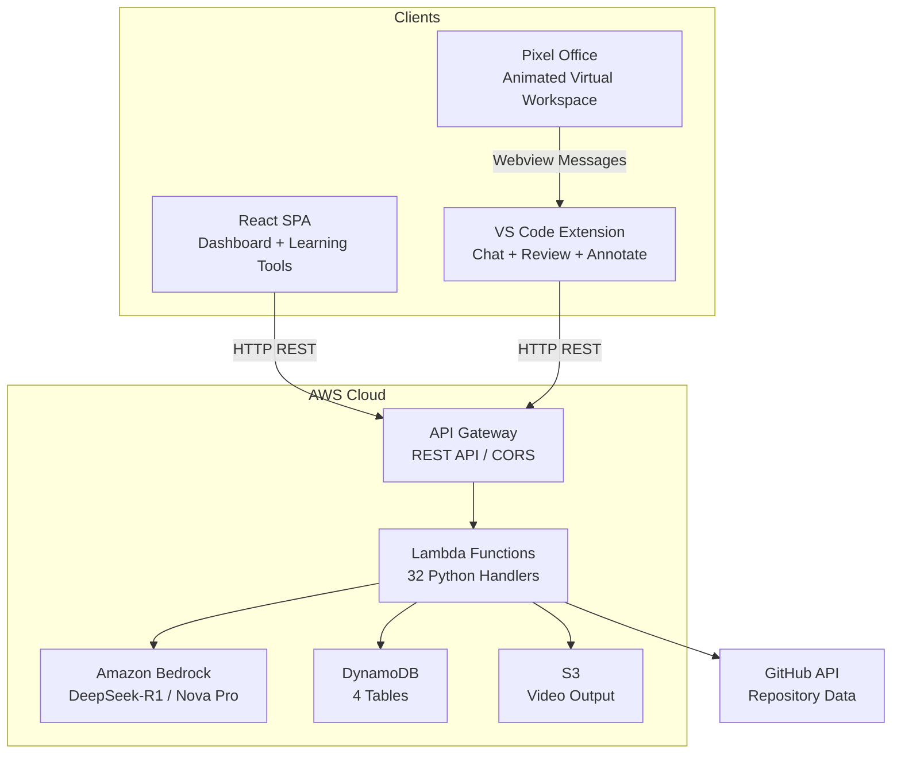
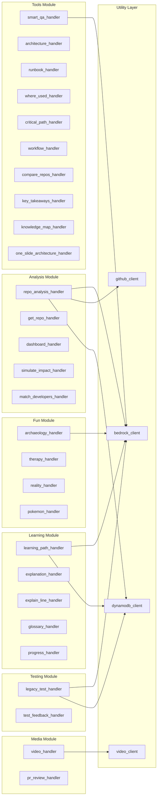
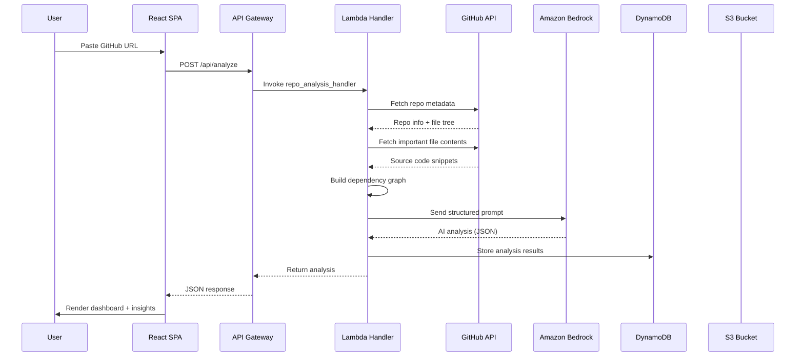
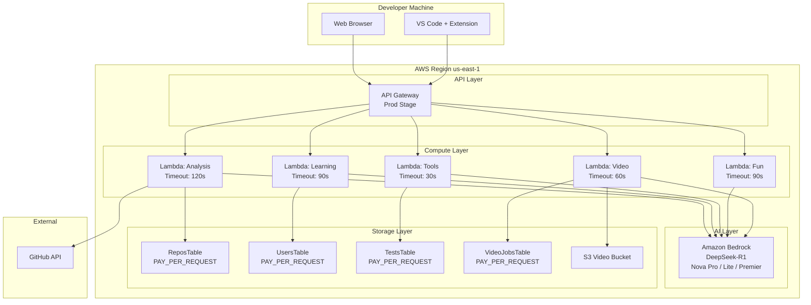

# CodeNarrative — Technical Documentation

---

## Table of Contents

1. [Project Overview](#1-project-overview)
2. [Problem Statement](#2-problem-statement)
3. [Proposed Solution](#3-proposed-solution)
4. [System Architecture](#4-system-architecture)
5. [Architecture Diagrams](#5-architecture-diagrams)
6. [Module Breakdown](#6-module-breakdown)
7. [Feature List](#7-feature-list)
8. [Innovation / Novelty](#8-innovation--novelty)
9. [Algorithms Used](#9-algorithms-used)
10. [Implementation Details](#10-implementation-details)
11. [Data Flow](#11-data-flow)
12. [Tech Stack](#12-tech-stack)
13. [Deployment Architecture](#13-deployment-architecture)
14. [Scalability and Performance](#14-scalability-and-performance)
15. [Future Enhancements](#15-future-enhancements)

---

## 1. Project Overview

### Project Objective

**CodeNarrative** is an AI-powered developer co-pilot designed to drastically reduce the time engineers spend onboarding onto unfamiliar, complex, or legacy codebases. It transforms any public GitHub repository into an interactive learning environment by combining:

- Deep repository analysis (architectural DNA, hidden coupling, performance risks)
- Personalised adaptive learning paths
- Multi-level code explanations (beginner → expert)
- Smart Q&A with full repository context
- Auto-generated architecture diagrams
- Spaced-repetition progress tracking
- Legacy test generation
- A VS Code extension with an embedded **Pixel Office** — an animated virtual workspace where AI agent sessions are visualised as pixel-art characters

### Problem Being Solved

New developers joining a team typically spend **3–6 months** before reaching full productivity on an unfamiliar codebase. Legacy systems with little documentation compound this problem further. CodeNarrative automates the discovery, explanation, and learning process so that engineers become effective in days, not months.

### Target Users

| User Segment | How CodeNarrative Helps |
|---|---|
| **New Hires / On-boarding Engineers** | Personalised learning paths, multi-level explanations, quizzes |
| **Open-Source Contributors** | One-click repo analysis, architecture maps, key takeaways |
| **Team Leads / Tech Leads** | Impact simulation ("if we remove Redis, what breaks?"), developer–module matching |
| **Hackathon Participants** | 60-second demo mode, instant architecture summaries, comparison tools |
| **QA Engineers** | Auto-generated legacy tests, test-feedback analysis |

### Key Idea

Turn any GitHub repository URL into a fully interactive AI-analysed learning environment — with zero setup from the repository owner — using Amazon Bedrock foundation models (DeepSeek-R1, Nova Pro/Lite/Premier) and a serverless AWS backend.

### Real-World Use Case

A mid-size company acquires a legacy Node.js monolith with 800+ files and no documentation. Instead of spending weeks reading code, the engineering lead pastes the GitHub URL into CodeNarrative. Within minutes, the tool surfaces:

- The **Architectural DNA** (patterns: MVC, event-driven, micro-frontend)
- **Critical files** ranked by dependency count ("if this file breaks, 14 modules are affected")
- **Hidden couplings** the team didn't know existed
- A **14-day learning path** tailored to backend engineers
- Auto-generated architecture diagrams the team can drop into presentations

### Why the Solution Is Needed

1. Documentation is perpetually outdated or absent.
2. Knowledge is siloed in senior engineers' heads.
3. Existing tools (IDEs, linters) show structure but don't *explain* or *teach*.
4. Onboarding is the single largest hidden cost in engineering organisations.

---

## 2. Problem Statement

### Current Industry Problem

Software projects grow in complexity far faster than documentation keeps up. The average codebase doubles in size every 18–24 months, yet onboarding processes remain largely manual: "read the README, ask around, grep the code."

### Why Existing Solutions Are Insufficient

| Existing Approach | Limitation |
|---|---|
| **Static documentation / wikis** | Goes stale within weeks of creation |
| **IDE code navigation** | Shows *where* things are, not *why* they exist |
| **Generic AI chat (ChatGPT, Copilot Chat)** | No deep repository context; hallucinates file structures |
| **Code search tools (Sourcegraph)** | Powerful search, no guided learning or explanations |
| **Onboarding checklists** | One-size-fits-all; no adaptation to the individual learner |

### Impact of the Problem

- **30–40% of an engineer's first 90 days** is spent reading code without writing any.
- Organisations lose **$50K–$150K per engineer** in reduced productivity during ramp-up.
- Knowledge silos create single points of failure ("bus factor = 1").

### Who Is Affected

- Individual developers (frustration, imposter syndrome)
- Engineering managers (delayed project timelines)
- Organisations (wasted budget, high turnover of frustrated new joiners)

---

## 3. Proposed Solution

### High-Level Approach

CodeNarrative provides a **three-layer solution**:

1. **Analysis Layer** — Fetches the GitHub repository, identifies important files using a scoring heuristic, builds a dependency graph, extracts imports, and sends structured prompts to Amazon Bedrock models for deep analysis.
2. **Learning Layer** — Transforms the analysis into personalised, multi-level explanations, adaptive learning paths, quizzes, spaced-repetition reviews, and interactive tools (runbooks, critical paths, knowledge maps).
3. **Experience Layer** — Delivers everything through a polished React SPA, a VS Code extension with in-editor explanations, and an animated Pixel Office that visualises AI sessions as pixel characters.

### Key System Components

| Component | Role |
|---|---|
| **React SPA (Frontend)** | Dashboard, analysis, learning paths, Q&A, tools, progress tracking |
| **AWS SAM Backend** | 32 Python Lambda handlers behind API Gateway |
| **Amazon Bedrock** | Foundation model inference (DeepSeek-R1, Nova Pro/Lite/Premier) |
| **DynamoDB** | Persistent storage for repos, users, tests, video jobs |
| **S3** | Video output storage |
| **GitHub API** | Repository metadata, file tree, file content fetching |
| **VS Code Extension** | In-editor explanations, chat, code review, annotations, Pixel Office |
| **Pixel Office Webview** | Animated canvas-based virtual office for visualising AI activity |

### How the Solution Addresses the Problem

- **Contextual understanding** — Bedrock analyses the *actual* code, not generic documentation.
- **Adaptive difficulty** — Explanations scale from "new grad" to "staff engineer" level.
- **Active learning** — Quizzes and spaced-repetition enforce retention.
- **Always up to date** — Re-analyse the repo any time; the AI reads the current code.
- **Zero setup for repo owners** — Works on any public GitHub repository.

### Benefits

- 10× faster onboarding for new team members
- Living, always-current documentation generated on demand
- Reduced knowledge silos through democratised codebase understanding
- Gamified learning with progress tracking and quiz scores

---

## 4. System Architecture

### High-Level Architecture

The system follows a **serverless, event-driven architecture** deployed entirely on AWS:

- **Frontend**: React SPA served via AWS Amplify / static hosting
- **API Gateway**: REST API with CORS, routing 30+ endpoints to Lambda functions
- **Lambda Functions**: Python 3.11 handlers — each endpoint is an independent function
- **Amazon Bedrock**: Foundation model inference via the Converse API
- **DynamoDB**: Four tables (Repos, Users, Tests, VideoJobs)
- **S3**: Video output bucket with Bedrock async invocation access
- **GitHub API**: External service for repository data fetching

### Component-Level Architecture

```
┌──────────────────────────────────────────────────────────────────┐
│                        CLIENT LAYER                              │
│  ┌─────────────────┐   ┌──────────────────┐   ┌──────────────┐  │
│  │  React SPA      │   │  VS Code Ext     │   │ Pixel Office │  │
│  │  (Vite+Tailwind)│   │  (TypeScript)    │   │ (React 19)   │  │
│  └────────┬────────┘   └────────┬─────────┘   └──────┬───────┘  │
│           │                     │                     │          │
│           └─────────────┬───────┴─────────────────────┘          │
│                         │ HTTP REST                              │
├─────────────────────────┼────────────────────────────────────────┤
│                   API GATEWAY (Prod Stage)                       │
├─────────────────────────┼────────────────────────────────────────┤
│                 LAMBDA HANDLERS (32 functions)                   │
│  ┌──────────┐ ┌────────────┐ ┌──────────┐ ┌──────────────────┐  │
│  │ Analysis │ │ Learning   │ │ Explain  │ │ Fun Features     │  │
│  │ Engine   │ │ Engine     │ │ Engine   │ │ (Archaeology,    │  │
│  │          │ │            │ │          │ │  Therapy, Pokémon)│  │
│  └──────────┘ └────────────┘ └──────────┘ └──────────────────┘  │
├──────────────────────────────────────────────────────────────────┤
│                       SERVICE LAYER                              │
│  ┌──────────────┐  ┌────────────┐  ┌──────────────┐             │
│  │ Bedrock      │  │ GitHub     │  │ DynamoDB     │             │
│  │ Client       │  │ Client     │  │ Client       │             │
│  │ (Converse)   │  │ (REST API) │  │ (boto3)      │             │
│  └──────────────┘  └────────────┘  └──────────────┘             │
├──────────────────────────────────────────────────────────────────┤
│                       DATA LAYER                                 │
│  ┌───────────┐ ┌───────────┐ ┌──────────┐ ┌──────────────────┐  │
│  │ ReposTable│ │ UsersTable│ │TestsTable│ │ VideoJobsTable   │  │
│  │ (DynamoDB)│ │ (DynamoDB)│ │(DynamoDB)│ │ (DynamoDB) + S3  │  │
│  └───────────┘ └───────────┘ └──────────┘ └──────────────────┘  │
└──────────────────────────────────────────────────────────────────┘
```

### Data Flow Between Modules

1. **User** → React SPA / VS Code Extension → HTTP request to API Gateway
2. **API Gateway** → routes to specific Lambda handler
3. **Lambda handler** → reads repo data from DynamoDB / fetches from GitHub API
4. **Lambda handler** → constructs prompt → calls Amazon Bedrock (Converse API)
5. **Bedrock** → returns AI-generated JSON response
6. **Lambda** → stores results in DynamoDB → returns JSON to client
7. **Client** → renders results (charts, diagrams, markdown, etc.)

### External Services Used

| Service | Purpose |
|---|---|
| **Amazon Bedrock** | Foundation model inference (DeepSeek-R1, Nova Pro, Nova Lite, Nova Premier) |
| **GitHub REST API** | Repository metadata, file trees, file content |
| **AWS DynamoDB** | NoSQL document storage |
| **AWS S3** | Video output storage |
| **AWS API Gateway** | REST API management with CORS |
| **AWS Lambda** | Serverless compute |

---

## 5. Architecture Diagrams

### 5.1 High-Level System Architecture



### 5.2 Module-Wise Architecture



### 5.3 Feature-Wise Architecture

```mermaid
graph TD
    User[User] --> Landing[Landing Page]
    Landing --> Analyze[Repo Analysis]
    Analyze --> Dashboard[Health Dashboard]
    Analyze --> Impact[Impact Simulation]
    Analyze --> DevMatch[Developer Matching]

    Landing --> Learn[Learning Features]
    Learn --> LP[Learning Path Generator]
    Learn --> Explain[Multi-Level Explanations]
    Learn --> Quiz[Quizzes + Spaced Repetition]
    Learn --> Progress[Progress Tracking]

    Landing --> Tools[Developer Tools]
    Tools --> QA[Smart Q&A]
    Tools --> Arch[Architecture Diagrams]
    Tools --> Runbook[Runbook Generator]
    Tools --> WhereUsed[Where-Used Finder]
    Tools --> Compare[Repo Comparison]
    Tools --> Critical[Critical Path Finder]

    Landing --> Fun[Fun Features]
    Fun --> Archaeology[Code Archaeology]
    Fun --> Therapy[Code Therapy]
    Fun --> Reality[Reality Show]
    Fun --> Pokemon[Pokémon Cards]

    Landing --> Media[Media]
    Media --> Video[Video Generation]
    Media --> PR[PR Review]
```



### 5.4 Data Flow Architecture



### 5.5 Deployment Architecture



---

## 6. Module Breakdown

### 6.1 Repository Analysis Module

| Attribute | Detail |
|---|---|
| **Purpose** | Deep-dive analysis of any GitHub repository |
| **Functionality** | Fetches repo metadata, file tree, important files; builds dependency graph; calls Bedrock for architectural DNA, hidden coupling, performance risks, MRI critical files |
| **Technologies** | Python 3.11, boto3, GitHub REST API, Amazon Bedrock (Converse API) |
| **Inputs** | GitHub repository URL |
| **Outputs** | Analysis JSON (architectural DNA traits, coupling matrix, risk scores, critical files with dependency counts) |

**Key files:** `repo_analysis_handler.py`, `github_client.py`, `bedrock_client.py`

### 6.2 Learning & Explanation Module

| Attribute | Detail |
|---|---|
| **Purpose** | Personalised learning paths, multi-level explanations, glossary, quizzes |
| **Functionality** | Generates 7–21 day learning paths tailored to experience level; explains code at beginner/intermediate/expert levels with optional persona (designer, PM, new grad, staff); inline quizzes; spaced-repetition review suggestions |
| **Technologies** | Python 3.11, Amazon Bedrock, DynamoDB (Users table) |
| **Inputs** | Repo ID, experience level, background, user ID, code snippet, line number |
| **Outputs** | Structured learning path JSON, multi-level explanation markdown, quiz questions, review schedule |

**Key files:** `learning_path_handler.py`, `explanation_handler.py`, `explain_line_handler.py`, `glossary_handler.py`, `review_handler.py`, `digest_handler.py`

### 6.3 Developer Tools Module

| Attribute | Detail |
|---|---|
| **Purpose** | On-demand AI-powered developer utilities |
| **Functionality** | Smart Q&A with repo context; architecture diagram generation (Mermaid); runbook generation; symbol/file usage finder; critical path analysis; workflow minimap; repo comparison; key takeaways; knowledge ownership map; one-slide architecture |
| **Technologies** | Python 3.11, Amazon Bedrock, DynamoDB |
| **Inputs** | Repo ID + tool-specific parameters (question, feature name, symbol, other repo URL, etc.) |
| **Outputs** | Tool-specific JSON/markdown responses |

**Key files:** `smart_qa_handler.py`, `architecture_handler.py`, `runbook_handler.py`, `where_used_handler.py`, `critical_path_handler.py`, `workflow_handler.py`, `compare_repos_handler.py`, `key_takeaways_handler.py`, `knowledge_map_handler.py`, `one_slide_architecture_handler.py`

### 6.4 Testing Module

| Attribute | Detail |
|---|---|
| **Purpose** | Auto-generate tests for legacy code; analyse why tests fail |
| **Functionality** | Generates unit tests for specified functions using Bedrock; stores tests in DynamoDB; provides test-failure feedback analysis |
| **Technologies** | Python 3.11, Amazon Bedrock, DynamoDB (Tests table) |
| **Inputs** | Repo ID, file path, function names, test code |
| **Outputs** | Generated test code, test metadata, failure analysis |

**Key files:** `legacy_test_handler.py`, `test_feedback_handler.py`

### 6.5 Progress & Gamification Module

| Attribute | Detail |
|---|---|
| **Purpose** | Track learning progress, quiz scores, and review schedules |
| **Functionality** | Get/update progress per user per repo; record quiz scores; calculate metrics (files explored, modules completed, streak days) |
| **Technologies** | Python 3.11, DynamoDB (Users table) |
| **Inputs** | User ID, Repo ID, progress updates, quiz scores |
| **Outputs** | Progress metrics JSON |

**Key files:** `progress_handler.py`

### 6.6 Fun Features Module

| Attribute | Detail |
|---|---|
| **Purpose** | Engaging, creative views of the codebase to make onboarding enjoyable |
| **Functionality** | **Code Archaeology**: uncover the oldest, most modified, most mysterious code; **Code Therapy**: therapeutic AI conversations about problematic modules; **Reality Show**: dramatic narrative of code conflicts; **Pokémon Cards**: modules as collectible cards with stats |
| **Technologies** | Python 3.11, Amazon Bedrock |
| **Inputs** | Repo ID, optional module names / show type |
| **Outputs** | Creative narrative JSON/markdown |

**Key files:** `archaeology_handler.py`, `therapy_handler.py`, `reality_handler.py`, `pokemon_handler.py`

### 6.7 Media Module

| Attribute | Detail |
|---|---|
| **Purpose** | Video generation and PR review |
| **Functionality** | Start async video generation via Bedrock; poll job status; review pull requests with AI analysis |
| **Technologies** | Python 3.11, Amazon Bedrock (async invocation), S3, DynamoDB (VideoJobs table) |
| **Inputs** | Repo ID, video type, PR URL |
| **Outputs** | Video job status, video URL (S3 presigned), PR review analysis |

**Key files:** `video_handler.py`, `pr_review_handler.py`

### 6.8 Frontend Module (React SPA)

| Attribute | Detail |
|---|---|
| **Purpose** | Full-featured web application for all CodeNarrative features |
| **Functionality** | 14 route pages; animated landing page; interactive dashboard with Recharts charts; Mermaid diagram rendering; markdown rendering with syntax highlighting; mock mode for offline demos; API client with retry logic |
| **Technologies** | React 18, Vite, Tailwind CSS 3, React Router 6, Recharts, Mermaid, react-markdown, react-syntax-highlighter |
| **Inputs** | User interactions |
| **Outputs** | Rendered UI with charts, diagrams, markdown, progress bars, etc. |

**Key files:** `App.jsx`, `api/client.js`, `components/Dashboard.jsx`, `components/Landing.jsx`, `components/RepoAnalysis.jsx`, `components/LearningPath.jsx`, `components/Explanations.jsx`, `components/SmartQA.jsx`, `components/Tools.jsx`, `components/ArchitectureMap.jsx`, `components/ProgressTracking.jsx`, `components/LegacyTests.jsx`, `components/Videos.jsx`, `components/PRReview.jsx`

### 6.9 VS Code Extension Module

| Attribute | Detail |
|---|---|
| **Purpose** | Bring CodeNarrative capabilities directly into the developer's IDE |
| **Functionality** | 8 commands (Explain Selection, Summarize File, Open Chat, Open Dashboard, Review Code, Generate Changelog, Generate PR Description, Annotate File); side panel chat webview; dashboard webview; Pixel Office panel; session tracking for AI agent visualisation |
| **Technologies** | TypeScript, VS Code Webview API, Pixel Office React webview |
| **Inputs** | Code selections, editor context, user commands |
| **Outputs** | Explanations, summaries, reviews, annotations rendered as inline decorations / webview panels |

**Key files:** `extension.ts`, `SidePanelProvider.ts`, `DashboardViewProvider.ts`, `OfficeViewProvider.ts`, `SessionEvents.ts`, `LayoutStore.ts`, `ApiKeyManager.ts`, `CodeNarrativeClient.ts`

### 6.10 Pixel Office Module

| Attribute | Detail |
|---|---|
| **Purpose** | Gamified, animated virtual office visualising AI coding sessions |
| **Functionality** | Canvas-based 2D rendering; pixel-art character animations; BFS pathfinding; office layout editor with furniture; live activity tracking from agent JSONL transcripts; speech bubbles; sound notifications; sub-agent visualisation; persistent layouts |
| **Technologies** | React 19, TypeScript, Canvas 2D, Vite |
| **Inputs** | Agent session events from VS Code extension host |
| **Outputs** | Animated pixel office canvas |

**Key files:** `App.tsx`, `constants.ts`, `notificationSound.ts`, `office/` directory (25 files)

### 6.11 Utility / Shared Module

| Attribute | Detail |
|---|---|
| **Purpose** | Reusable clients and helpers for backend handlers |
| **Functionality** | Bedrock Converse API wrapper with retry and markdown-fence stripping; GitHub API client with file scoring, dependency graph building, and import extraction; DynamoDB CRUD helpers; Video client |
| **Technologies** | Python 3.11, boto3, urllib |
| **Inputs** | Prompts, GitHub URLs, table operations |
| **Outputs** | Parsed JSON from Bedrock, repo data from GitHub, DynamoDB items |

**Key files:** `bedrock_client.py`, `github_client.py`, `dynamodb_client.py`, `video_client.py`

---

## 7. Feature List

### 7.1 Repository Analysis

| Feature | Description | Importance | How It Works |
|---|---|---|---|
| **One-Click Repo Analysis** | Paste any GitHub URL and get a full AI analysis | Core feature — the foundation of everything else | Lambda fetches file tree → picks important files by scoring heuristic → fetches content → builds dependency graph → sends to Bedrock for analysis |
| **Architectural DNA** | Identifies patterns (MVC, event-driven, monolith, etc.) | Gives instant high-level understanding | Bedrock analyses file structure and content to detect architectural patterns |
| **MRI Critical Files** | Ranks files by how many modules depend on them | Shows the "nerve centre" of the codebase | Dependency graph built from import extraction; files ranked by used_by count |
| **Hidden Coupling** | Detects undocumented dependencies between modules | Prevents surprises during refactoring | Import analysis crosses module boundaries to find unexpected connections |
| **Performance Risks** | Identifies potential bottlenecks | Proactive risk management | Bedrock analyses patterns like synchronous I/O, N+1 queries, missing caching |
| **Impact Simulation** | "What if we remove Redis?" scenario analysis | Strategic planning for tech leads | Bedrock simulates the cascade effect given the dependency graph |
| **Health Dashboard** | Visual health metrics with charts | Quick pulse check on repo quality | Recharts renders scores for documentation, test coverage, complexity |
| **Developer–Module Matching** | Matches team members to the best modules for them | Optimises team allocation | Bedrock matches developer profiles to module characteristics |

### 7.2 Learning Features

| Feature | Description | Importance | How It Works |
|---|---|---|---|
| **Adaptive Learning Paths** | 7–21 day personalised curriculum | Structured onboarding for new engineers | User provides experience level + background; Bedrock generates sequenced learning plan |
| **Multi-Level Explanations** | Beginner / Intermediate / Expert views of any file | Ensures everyone understands at their level | Same code explained differently with persona-specific language |
| **Line-Level Explanation** | Ask about a specific line of code | Deep understanding when stuck | Line context sent to Bedrock with surrounding code |
| **Glossary** | Level-based definitions for project terms | Handles jargon overload | Term + repo context sent to Bedrock; response tailored to beginner/advanced |
| **Quizzes** | Auto-generated questions after explanations | Active recall for better retention | Bedrock generates quiz questions from explained code |
| **Spaced Repetition** | Review suggestions based on past activity | Science-backed learning retention | SM-2 inspired scheduling based on quiz scores and time since last review |
| **Progress Tracking** | Files explored, modules completed, streak days | Motivation via gamification | DynamoDB tracks per-user-per-repo metrics |

### 7.3 Developer Tools

| Feature | Description | Importance | How It Works |
|---|---|---|---|
| **Smart Q&A** | Ask any question about the repo | Instant answers without reading code | Bedrock answers using full repo analysis as context |
| **Architecture Diagrams** | Auto-generated Mermaid diagrams | Visual understanding at a glance | Bedrock generates diagram code; rendered by Mermaid.js in frontend |
| **Runbook Generator** | How to run, test, deploy the project | New engineer self-service | Bedrock analyses package.json, Dockerfile, CI configs to produce runbook |
| **Where-Used Finder** | Find everywhere a symbol/file is used | Impact analysis for changes | Dependency graph lookup + Bedrock enrichment |
| **Critical Path** | Trace the path for a feature from entry to output | Feature-level understanding | Bedrock traces through the codebase graph for a given feature name |
| **Workflow Minimap** | Visualise a named flow (e.g. "user login") | Process understanding | Bedrock generates step-by-step flow with involved files |
| **Repo Comparison** | Compare two GitHub repos | Competitive analysis / tech evaluation | Both repos analysed; Bedrock generates comparison matrix |
| **Key Takeaways** | 5-bullet summary for new joiners | First-day orientation | Bedrock distils the analysis into the most important points |
| **Knowledge Map** | Component → owner/role mapping | Team coordination | Bedrock maps code areas to team roles based on patterns |
| **One-Slide Architecture** | Single-slide summary for presentations | Stakeholder communication | Bedrock generates a concise architecture overview |
| **PR Review** | AI-powered pull request review | Code quality assurance | Fetches PR diff from GitHub; Bedrock analyses for bugs, style, performance |

### 7.4 Fun / Engagement Features

| Feature | Description | Importance | How It Works |
|---|---|---|---|
| **Code Archaeology** | Uncover the oldest, most-modified, most mysterious code | Makes exploration fun | Bedrock creates a "dig report" narrative |
| **Code Therapy** | Therapeutic conversation about problematic modules | Humour reduces onboarding stress | Bedrock role-plays as a therapist for the code |
| **Reality Show** | Dramatic narrative of code conflicts and drama | Memorable learning | Bedrock creates a reality TV script featuring modules as characters |
| **Pokémon Cards** | Modules as collectible cards with stats | Gamification | Bedrock generates HP, Attack, Defence stats with special moves |
| **Video Generation** | AI-generated video walkthroughs | Content creation | Bedrock async invocation generates video stored in S3 |

### 7.5 VS Code Extension Features

| Feature | Description | Importance | How It Works |
|---|---|---|---|
| **Explain Selection** | Select code → right-click → get narrative explanation | In-context learning | Selection text sent to Code Narrative API |
| **Summarize File** | One-click file summary | Quick understanding | Full file content sent for summarisation |
| **Chat Panel** | Side panel with conversational AI | Interactive Q&A | Webview-based chat connected to backend |
| **Dashboard Panel** | Extension-embedded dashboard | Quick access to metrics | Webview rendering repo health data |
| **Code Review** | AI-powered code review | Quality assurance | Context-aware review via /review command |
| **Annotate File** | Inline AI annotations for functions | Visual guide to code | Document symbols extracted; each sent for one-sentence summary; rendered as inline decorations |
| **Changelog** | Generate changelog from git history | Release management | Git diff analysis via AI |
| **PR Description** | Auto-generate PR descriptions | Productivity boost | Staged changes analysed and described |

### 7.6 Pixel Office

| Feature | Description | Importance | How It Works |
|---|---|---|---|
| **Animated Characters** | 6 diverse pixel-art characters | Visual engagement | Canvas 2D sprite animation with state machine |
| **Live Activity Tracking** | Characters animate based on agent activity | Real-time feedback | JSONL transcript file watching |
| **Office Layout Editor** | Design your virtual office | Personalisation | Grid-based editor with HSB colour control |
| **Speech Bubbles** | Visual indicators for agent status | Status awareness | State-driven bubble rendering |
| **Sound Notifications** | Audio alerts when agents finish | Multitasking support | Programmatic audio synthesis |
| **Persistent Layouts** | Saved across sessions | Consistency | VS Code globalState persistence |

---

## 8. Innovation / Novelty

### Novelty Compared to Existing Systems

1. **Repository-as-a-Learning-Platform** — No existing tool transforms a GitHub URL into a full adaptive learning environment. Tools like Sourcegraph search code; CodeNarrative *teaches* it.

2. **Multi-Model AI Architecture** — CodeNarrative uses multiple Bedrock models simultaneously: DeepSeek-R1 for deep reasoning, Nova Pro for complex analysis, Nova Lite for fast Q&A, and Nova Premier with web grounding for real-time context.

3. **Dependency-Aware Analysis** — The system doesn't just ask AI about code. It first builds a static dependency graph from import analysis (Python `import`/`from`, JS/TS `require`/`import`), then feeds this structural data to the AI for context-aware responses.

4. **Pixel Office Gamification** — No other developer tool visualises AI agent sessions as animated pixel-art characters in a virtual office. This transforms a mundane developer tool into an engaging experience.

5. **Impact Simulation Engine** — The "what if we remove X?" capability doesn't exist in any current developer tool. It combines dependency graph data with AI reasoning to simulate architectural changes.

### Unique Technical Ideas

- **File Importance Scoring Heuristic**: A multi-factor scoring algorithm (file name matching, path pattern matching, config detection, size-based scoring) that intelligently selects the most relevant files for AI analysis out of potentially thousands of files.

- **Markdown Fence Stripping**: Robust parsing of AI model outputs that may be wrapped in various markdown formats, ensuring reliable JSON extraction.

- **Mock-First Development**: The entire system can run without any backend through a comprehensive mock layer, enabling offline demos and development.

- **Converse API Abstraction**: A unified Bedrock client that works across DeepSeek-R1, Claude, Nova Pro, and Nova Lite through the Converse API — model-agnostic by design.

### How This Solution Differs from Traditional Approaches

| Traditional Approach | CodeNarrative Approach |
|---|---|
| Human writes documentation | AI generates documentation on demand from live code |
| One-size-fits-all onboarding | Adaptive, personalised learning paths |
| Static architecture diagrams | AI-generated, always-current Mermaid diagrams |
| Ask a senior engineer | Ask the AI with full repo context |
| Read code to understand code | Multi-level explanations with persona-specific language |
| Manual risk assessment | Automated dependency graph + AI impact simulation |

---

## 9. Algorithms Used

### 9.1 File Importance Scoring Algorithm

**Purpose**: Select the most analytically valuable files from a repository (potentially thousands of files) for AI analysis.

**Algorithm**:
```
For each file in repository:
    score = 0
    if filename ∈ IMPORTANT_FILE_NAMES:           score += 100
    if filename starts with CONFIG_PREFIX:          score += 80
    if is_important_file(path):                    score += 50
    if "main" | "index" | "app" in filename:       score += 40
    if "config" | "settings" in path:              score += 25
    if path matches IMPORTANT_PATH_PATTERNS:       score += 30
    score += min(file_size / 500, 20)              // size bonus

Sort by score DESC → return top 28 files
```

### 9.2 Dependency Graph Construction Algorithm

**Purpose**: Build a "used_by" count for each file, showing how many other files depend on it.

**Algorithm**:
1. For each file with its source snippet:
   - Extract imports using language-specific regex parsers (Python: `import`/`from`, JS/TS: `require`/`import from`)
   - Resolve each import string to actual file paths using path matching against the full file tree
2. Build an inverted index: for each target file, track which files import it
3. Return `{ path: count_of_importers }` — files with higher counts are more critical

### 9.3 Spaced Repetition Scheduling (SM-2 Inspired)

**Purpose**: Determine optimal review timing for learned modules.

**Algorithm**: Based on the SuperMemo SM-2 algorithm:
- After each quiz, compute an easiness factor based on the score
- Schedule the next review at increasing intervals (1, 3, 7, 14, 30 days)
- Lower scores → shorter intervals → more frequent review

### 9.4 BFS Pathfinding (Pixel Office)

**Purpose**: Navigate pixel characters to target positions in the virtual office grid.

**Algorithm**: Breadth-First Search on a 2D tile grid:
- Source: character's current tile
- Target: assigned desk/seat tile
- Obstacles: walls, furniture, other characters
- Output: shortest path as a sequence of tile coordinates

### 9.5 Character State Machine (Pixel Office)

**Purpose**: Animate characters based on AI agent activity.

**States**: `idle → walk → type | read | wait`

**Transitions**:
- Agent starts writing code → character transitions to `type` animation
- Agent searches/reads files → character transitions to `read` animation
- Agent waiting for user input → character shows speech bubble + `wait` state
- No activity for N seconds → return to `idle`

### 9.6 AI/ML Models Used

| Model | Provider | Use Case |
|---|---|---|
| **DeepSeek-R1** | Amazon Bedrock | Primary reasoning model for deep analysis, explanations, learning paths |
| **Amazon Nova Pro** | Amazon Bedrock | Complex tasks: repo analysis (with web grounding), architecture |
| **Amazon Nova Lite** | Amazon Bedrock | Lightweight tasks: Q&A, glossary, quick lookups |
| **Amazon Nova Premier** | Amazon Bedrock | Multimodal analysis with web grounding (real-time search, citations) |

All models are accessed through the **Amazon Bedrock Converse API**, which provides a unified interface regardless of the underlying model.

---

## 10. Implementation Details

### 10.1 Tech Stack Summary

| Layer | Technology |
|---|---|
| **Frontend** | React 18, Vite 5, Tailwind CSS 3, React Router 6, Recharts, Mermaid.js, react-markdown |
| **Backend** | Python 3.11, AWS SAM, AWS Lambda, API Gateway |
| **AI** | Amazon Bedrock (DeepSeek-R1, Nova Pro/Lite/Premier) |
| **Database** | Amazon DynamoDB (4 tables, PAY_PER_REQUEST) |
| **Storage** | Amazon S3 (video outputs) |
| **External API** | GitHub REST API v3 |
| **VS Code Extension** | TypeScript, VS Code Webview API |
| **Pixel Office** | React 19, TypeScript, Canvas 2D |
| **Build Tools** | SAM CLI, Vite, esbuild, tsc |
| **Deployment** | AWS SAM (CloudFormation), AWS Amplify |

### 10.2 Backend Implementation

**Structure**: 32 independent Lambda handlers in `backend/handlers/`, each mapped to an API Gateway route via `template.yaml`.

**Shared Utilities** (`backend/utils/`):
- `bedrock_client.py` — Converse API wrapper with retry on throttling, markdown-fence stripping, safe-call fallback
- `github_client.py` — URL parsing, metadata/tree/content fetching, import extraction, dependency graph construction
- `dynamodb_client.py` — CRUD helpers for all 4 tables
- `video_client.py` — Bedrock async invocation for video generation

**Key Handler Patterns**:
```python
def lambda_handler(event, context):
    # 1. Parse request body
    body = json.loads(event.get("body", "{}"))
    repo_id = body.get("repo_id")

    # 2. Fetch repo data from DynamoDB
    repo = dynamodb_client.get_repo(repo_id)

    # 3. Construct AI prompt with repo context
    prompt = f"Given this repo analysis: {repo['analysis']}..."

    # 4. Call Bedrock (with fallback)
    result = safe_bedrock(prompt, fallback_data)

    # 5. Return JSON response with CORS headers
    return {
        "statusCode": 200,
        "headers": cors_headers,
        "body": json.dumps(result)
    }
```

### 10.3 Frontend Implementation

**Structure**: Single-page application with 14 routes.

**Key Patterns**:
- **API Client** (`api/client.js`): Centralised request function with mock fallback, retry on 502/503/504, friendly error messages
- **Mock System** (`mocks/`): 11 mock files enabling full offline demo mode via `VITE_USE_MOCKS=true`
- **Context Provider** (`context/RepoContext.jsx`): Global repository state management
- **Component Architecture**: Each route is a self-contained component; shared UI in `components/ui/`

**Main Routes**:

| Route | Component | Description |
|---|---|---|
| `/` | `Landing` | Animated landing page with feature showcase |
| `/dashboard` | `Dashboard` | Repo health metrics with Recharts charts |
| `/analysis` | `RepoAnalysis` | Deep analysis results with critical files, DNA traits |
| `/learning-path` | `LearningPath` | Personalised learning curriculum |
| `/qa` | `SmartQA` | Interactive Q&A with markdown rendering |
| `/explanations` | `Explanations` | Multi-level code explanations with quiz generation |
| `/architecture` | `ArchitectureMap` | Mermaid diagram rendering |
| `/tools` | `Tools` | Runbook, where-used, critical path, comparison, etc. |
| `/tests` | `LegacyTests` | Test generation and management |
| `/progress` | `ProgressTracking` | Learning progress visualisation |
| `/videos` | `Videos` | Video generation and playback |
| `/pr-review` | `PRReview` | AI-powered PR review |

### 10.4 APIs Created

The backend exposes **30+ REST endpoints** through API Gateway:

**Analysis APIs**:
- `POST /api/analyze` — Full repo analysis
- `GET /api/repos/{repo_id}` — Get stored analysis
- `POST /api/repos/{repo_id}/simulate-impact` — Impact simulation
- `GET /api/repos/{repo_id}/files?path=` — File content
- `GET /api/repos/{repo_id}/dashboard` — Health dashboard
- `POST /api/match-developers` — Developer matching

**Learning APIs**:
- `POST /api/learning-path` — Generate learning path
- `POST /api/explain` — Multi-level explanation
- `POST /api/explain-line` — Line-level explanation
- `POST /api/glossary` — Term definitions
- `GET /api/review?user_id=&repo_id=` — Spaced repetition
- `GET /api/digest?user_id=` — Learning digest

**Tool APIs**:
- `POST /api/qa` — Smart Q&A
- `POST /api/architecture` — Architecture diagrams
- `POST /api/runbook` — Runbook
- `POST /api/where-used` — Symbol usage
- `POST /api/critical-path` — Critical path
- `POST /api/workflow` — Workflow minimap
- `POST /api/compare-repos` — Repo comparison
- `POST /api/key-takeaways` — Key takeaways
- `GET /api/knowledge-map?repo_id=` — Knowledge map
- `POST /api/one-slide-architecture` — One-slide summary
- `POST /api/test-feedback` — Test failure analysis
- `POST /api/pr-review` — PR review

**Progress APIs**:
- `GET /api/progress/{uid}/{rid}` — Get progress
- `POST /api/progress/update` — Update progress
- `POST /api/progress/quiz-score` — Record quiz score

**Testing APIs**:
- `POST /api/tests/generate` — Generate tests
- `GET /api/tests/{repo_id}` — List tests

**Fun APIs**:
- `POST /api/archaeology`, `/therapy`, `/reality`, `/pokemon`

**Media APIs**:
- `POST /api/video/start`, `GET /api/video/status/{job_id}`

### 10.5 Database Schema

**ReposTable** (DynamoDB):
| Field | Type | Description |
|---|---|---|
| `repo_id` (PK) | String | Hash of GitHub URL |
| `github_url` | String | Original repository URL |
| `owner` | String | Repository owner |
| `repo` | String | Repository name |
| `analysis` | Map | Full AI analysis results |
| `file_tree` | List | Repository file structure |
| `important_files` | List | Selected files with content |
| `created_at` | String | ISO timestamp |
| `status` | String | analyzing / complete / error |

**UsersTable** (DynamoDB):
| Field | Type | Description |
|---|---|---|
| `user_id` (PK) | String | User identifier |
| `repo_id` (SK) | String | Repository identifier |
| `progress` | Map | Files explored, modules completed, streaks |
| `quiz_scores` | List | Historical quiz results |
| `learning_path` | Map | Generated learning path |
| `last_active` | String | ISO timestamp |

**TestsTable** (DynamoDB):
| Field | Type | Description |
|---|---|---|
| `repo_id` (PK) | String | Repository identifier |
| `test_id` (SK) | String | Unique test identifier |
| `file_path` | String | Source file tested |
| `function_name` | String | Function under test |
| `test_code` | String | Generated test code |
| `created_at` | String | ISO timestamp |

**VideoJobsTable** (DynamoDB):
| Field | Type | Description |
|---|---|---|
| `job_id` (PK) | String | Video job identifier |
| `repo_id` | String | Associated repository |
| `status` | String | pending / processing / complete / failed |
| `video_url` | String | S3 presigned URL when complete |
| `created_at` | String | ISO timestamp |

### 10.6 AI Models Used

| Model | Bedrock Model ID | Use Cases | Max Tokens | Temperature |
|---|---|---|---|---|
| DeepSeek-R1 | `us.deepseek.r1-v1:0` | Primary model for all complex reasoning | 4096 | 0.2 |
| Nova Pro | `us.amazon.nova-pro-v1:0` | Repo analysis, learning paths | 4096 | 0.2 |
| Nova Lite | `us.amazon.nova-lite-v1:0` | Q&A, glossary, quick lookups | 4096 | 0.2 |
| Nova Premier | (with web grounding) | Real-time web-grounded repo analysis | 4096 | 0.2 |

---

## 11. Data Flow

### Complete System Data Flow (Step by Step)

```
Step 1: USER INPUT
└─> User pastes a GitHub repository URL into the React SPA
    (e.g., https://github.com/facebook/react)

Step 2: FRONTEND PROCESSING
└─> React SPA calls POST /api/analyze via the API client
    - The client prepends the API base URL
    - Sets Content-Type: application/json
    - Includes retry logic for 502/503/504 errors

Step 3: API GATEWAY ROUTING
└─> AWS API Gateway (Prod stage) receives the request
    - Validates HTTP method and path
    - Applies CORS headers
    - Routes to the RepoAnalysisFunction Lambda

Step 4: LAMBDA HANDLER — GitHub Data Fetching
└─> repo_analysis_handler.py:
    a. Parses the GitHub URL → extracts owner + repo name
    b. Calls GitHub REST API to fetch:
       - Repository metadata (stars, language, description)
       - Full file tree (recursive)
    c. Runs the File Importance Scoring Algorithm
       → Selects top 28 most important files
    d. Fetches content of selected files from GitHub API
    e. Optionally fetches up to 5 diagram images

Step 5: DEPENDENCY GRAPH CONSTRUCTION
└─> github_client.py:
    a. For each fetched file snippet:
       - Extracts imports using language-specific regex parsers
       - Python: `import X`, `from X import Y`
       - JS/TS: `require('X')`, `import X from 'Y'`
    b. Resolves import strings to actual file paths
    c. Builds inverted index: target → list of importers
    d. Computes used_by count per file

Step 6: AI ANALYSIS (DECISION ENGINE)
└─> bedrock_client.py:
    a. Constructs a structured prompt including:
       - Repository metadata
       - File tree structure
       - Source code of important files
       - Dependency graph data
    b. Calls Amazon Bedrock Converse API:
       - Model: DeepSeek-R1 / Nova Pro (configurable)
       - Max tokens: 4096, Temperature: 0.2
    c. Handles throttling with 2s retry
    d. Strips markdown fences from response
    e. Parses JSON output

Step 7: RESULT STORAGE
└─> dynamodb_client.py:
    a. Stores complete analysis in ReposTable:
       - Architectural DNA traits
       - MRI critical files with dependency counts
       - Hidden coupling matrix
       - Performance risk assessment
       - File tree and important file contents
    b. Sets status = "complete"

Step 8: RESPONSE TO CLIENT
└─> Lambda returns JSON response through API Gateway
    - Includes CORS headers
    - Status 200 with full analysis data

Step 9: FRONTEND RENDERING (OUTPUT)
└─> React SPA receives and renders:
    a. Dashboard: Health scores as radar charts (Recharts)
    b. Critical files: Sorted table with dependency counts
    c. Architectural DNA: Trait cards with descriptions
    d. Hidden coupling: Relationship matrix visualisation
    e. Performance risks: Risk cards with severity levels
    f. Architecture diagrams: Mermaid.js rendered diagrams
    g. Impact simulation: Interactive "what if" cards

Step 10: SUBSEQUENT USER INTERACTIONS
└─> User navigates to Learning Path, Q&A, Explanations, etc.
    Each feature follows the same pattern:
    Frontend → API Gateway → Lambda → (DynamoDB + Bedrock) → Response
```

---

## 12. Tech Stack

| Technology | Category | Why Chosen |
|---|---|---|
| **React 18** | Frontend Framework | Industry standard; component-based architecture; strong ecosystem; hooks for state management |
| **Vite 5** | Build Tool | Blazing-fast HMR; native ES modules; superior DX compared to webpack |
| **Tailwind CSS 3** | Styling | Utility-first; rapid prototyping; consistent design system; small production bundle |
| **React Router 6** | Routing | Standard React routing; nested routes; data loaders |
| **Recharts** | Charts | React-native charting; declarative API; responsive; great for dashboards |
| **Mermaid.js** | Diagrams | Text-to-diagram rendering; supports flowcharts, sequence, ER, and class diagrams |
| **react-markdown** | Markdown | Renders AI responses as rich markdown with customisable components |
| **react-syntax-highlighter** | Code Display | Language-aware syntax highlighting for code snippets |
| **Python 3.11** | Backend Language | AWS Lambda native runtime; rich ecosystem; fast development |
| **AWS SAM** | IaC Framework | First-class Lambda support; local testing; CloudFormation-based |
| **AWS Lambda** | Compute | Serverless; pay-per-invocation; auto-scaling; zero server management |
| **AWS API Gateway** | API Management | Managed REST API; built-in CORS; throttling; authentication support |
| **Amazon DynamoDB** | Database | Serverless NoSQL; single-digit ms latency; PAY_PER_REQUEST billing; infinite scale |
| **Amazon Bedrock** | AI/ML Platform | Managed access to multiple foundation models; Converse API for model-agnostic calls; no model hosting required |
| **DeepSeek-R1** | AI Model | Strong reasoning capabilities; available on Bedrock; no marketplace subscription needed |
| **Amazon S3** | Object Storage | Serverless file storage; presigned URLs; Bedrock async output support |
| **GitHub REST API** | External API | Standard access to repository data; well-documented; rate-limited but sufficient |
| **TypeScript** | Extension Language | Type safety for VS Code extension; better refactoring support; VS Code API types |
| **VS Code Webview API** | Extension UI | Renders custom React UIs inside VS Code panels |
| **Canvas 2D** | Pixel Office Rendering | Hardware-accelerated 2D rendering; pixel-perfect control; performant for sprite animation |
| **esbuild** | Extension Bundler | Extremely fast TypeScript bundling for the VS Code extension |

---

## 13. Deployment Architecture

### Cloud Services Used

| Service | Instance / Config | Purpose |
|---|---|---|
| **AWS Lambda** | Python 3.11, 512 MB, 30–120s timeout | Serverless compute for all API handlers |
| **AWS API Gateway** | REST API, Prod stage | Request routing, CORS, rate limiting |
| **Amazon DynamoDB** | 4 tables, PAY_PER_REQUEST | Persistent data storage |
| **Amazon S3** | 1 bucket, private + CORS | Video output storage |
| **Amazon Bedrock** | us-east-1 region | Foundation model inference |
| **AWS CloudFormation** | Via SAM template | Infrastructure provisioning |
| **AWS Amplify** (optional) | Static hosting | Frontend SPA hosting |

### Backend Hosting

The backend is deployed as a **SAM application** (`sam deploy --guided`), which creates:
- 32+ Lambda functions (one per API endpoint)
- 1 API Gateway REST API (Prod stage)
- 4 DynamoDB tables
- 1 S3 bucket
- IAM roles with least-privilege policies

### Database

All data persists in **Amazon DynamoDB** with PAY_PER_REQUEST billing:
- **ReposTable**: Partition key `repo_id`
- **UsersTable**: Partition key `user_id`, sort key `repo_id`
- **TestsTable**: Partition key `repo_id`, sort key `test_id`
- **VideoJobsTable**: Partition key `job_id`

### APIs

REST API exposed through API Gateway at:
```
https://<api-id>.execute-api.us-east-1.amazonaws.com/Prod/api/*
```

CORS configured for all origins (`*`) with methods GET, POST, OPTIONS.

### Deployment Steps

```bash
# 1. Deploy Backend
cd backend
sam build
sam deploy --guided

# 2. Note the ApiUrl from stack outputs

# 3. Configure Frontend
cd ../frontend
echo "VITE_API_BASE=<ApiUrl>/api" > .env.local
echo "VITE_USE_MOCKS=false" >> .env.local

# 4. Build and Deploy Frontend
npm install
npm run build
# Deploy dist/ to Amplify or any static host

# 5. VS Code Extension
cd ../vscode-extension
npm install
npm run compile
vsce package
# Install .vsix or publish to Marketplace
```

---

## 14. Scalability and Performance

### Load Handling

| Component | Scaling Mechanism |
|---|---|
| **Lambda Functions** | Auto-scale to 1000 concurrent executions (default); configurable reserved concurrency |
| **API Gateway** | 10,000 requests/second default; burstable to 5,000 |
| **DynamoDB** | PAY_PER_REQUEST = unlimited read/write capacity; auto-scales transparently |
| **S3** | Effectively unlimited storage and throughput |
| **Bedrock** | Region-based quotas; throttled requests retried with 2s delay |

### Optimisation Techniques

1. **Async Worker Pattern**: Repo analysis uses a two-Lambda architecture — a dispatcher (30s timeout) invokes a worker (120s timeout) asynchronously, preventing API Gateway's 29s limit from blocking long analyses.

2. **File Importance Scoring**: Instead of fetching all files from GitHub (which could be thousands), the scoring algorithm selects only the top 28 most relevant files, reducing API calls and Bedrock prompt size.

3. **Smart Retry Logic**: Both frontend and backend implement retry strategies:
   - Backend: Retry once on Bedrock ThrottlingException with 2s delay
   - Frontend: Retry on 502/503/504 with 2s delay

4. **Mock Mode**: `VITE_USE_MOCKS=true` eliminates all backend calls for development and demos, reducing infrastructure costs to zero during testing.

5. **PAY_PER_REQUEST Billing**: DynamoDB tables use on-demand capacity, so there's no cost when the system is idle.

6. **Efficient Prompts**: Prompts are constructed with structured context (file snippets, dependency data) rather than raw file dumps, keeping token usage within the 4096-token response limit.

### Future Scaling Strategy

- **DynamoDB DAX**: Add a DAX caching layer for frequently accessed analysis results
- **CloudFront CDN**: Place a CloudFront distribution in front of the SPA for global edge delivery
- **Lambda Provisioned Concurrency**: Pre-warm Lambda functions for the most latency-sensitive endpoints
- **Bedrock Provisioned Throughput**: Reserve model throughput for predictable workloads
- **Multi-Region**: Deploy the stack to additional AWS regions for global low-latency access
- **WebSocket API**: Replace polling (video status) with a WebSocket push model

---

## 15. Future Enhancements

### Short-Term (Next 3 Months)

| Enhancement | Description |
|---|---|
| **Private Repo Support** | Authenticated GitHub access for private repositories |
| **GitLab / Bitbucket Support** | Extend beyond GitHub to other Git platforms |
| **Streaming Responses** | Use Bedrock streaming for real-time AI response rendering |
| **Collaborative Learning** | Shared learning paths and progress across a team |
| **Custom Personas** | Let users define their own explanation personas beyond the built-in 4 |

### Medium-Term (3–6 Months)

| Enhancement | Description |
|---|---|
| **RAG Pipeline** | Build a vector store (pgvector / OpenSearch) for semantic code search |
| **Agent Memory** | Persistent conversation history using DynamoDB Streams |
| **Multi-Language Support** | Explanations in non-English languages |
| **CI/CD Integration** | Trigger analysis on every push via GitHub Actions / webhooks |
| **Custom Model Fine-Tuning** | Fine-tune Bedrock models on internal codebase patterns |

### Long-Term (6–12 Months)

| Enhancement | Description |
|---|---|
| **Enterprise SSO** | SAML / OIDC authentication for enterprise teams |
| **On-Premises Deployment** | Self-hosted option using AWS Outposts or EKS |
| **IDE Plugins** | Extend beyond VS Code to JetBrains IDEs, Neovim |
| **Real-Time Collaboration** | Multiple users learning the same repo simultaneously with shared annotations |
| **AI Code Tours** | Guided, step-by-step code walkthroughs with narration |
| **Automated Onboarding Plan** | Full onboarding document generation (Confluence, Notion integration) |
| **Assessment & Certification** | Verified skill assessments for engineers onboarding onto a codebase |

### Pixel Office Enhancements

| Enhancement | Description |
|---|---|
| **Agent Teams** | Native support for multi-agent coordination visualisation |
| **Desks as Directories** | Click a desk to assign a working directory |
| **Git Worktree Support** | Agents working in different worktrees for parallel work |
| **Custom Characters** | User-created pixel art characters |
| **Cross-Platform** | macOS and Linux support (currently Windows-only tested) |

---

*This document was auto-generated by analysing the complete CodeNarrative codebase across all 5 sub-projects: `codenarrative/backend`, `codenarrative/frontend`, `vscode-extension`, `pixel-office-webview`, and `pixel-agents-src`.*
